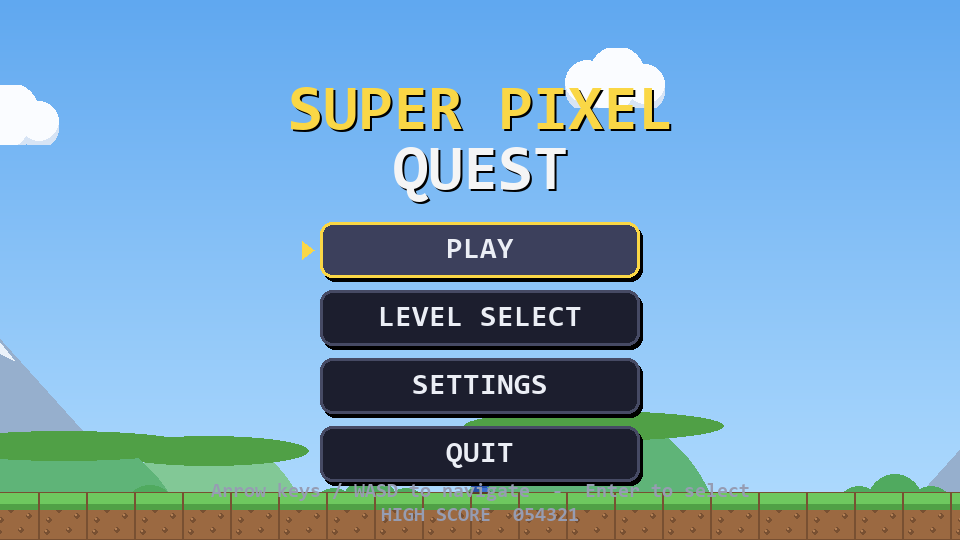
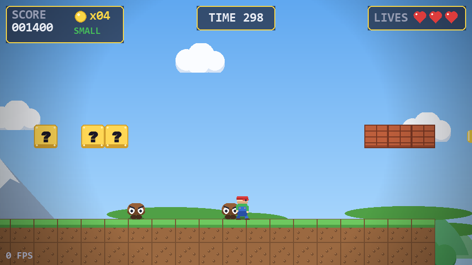
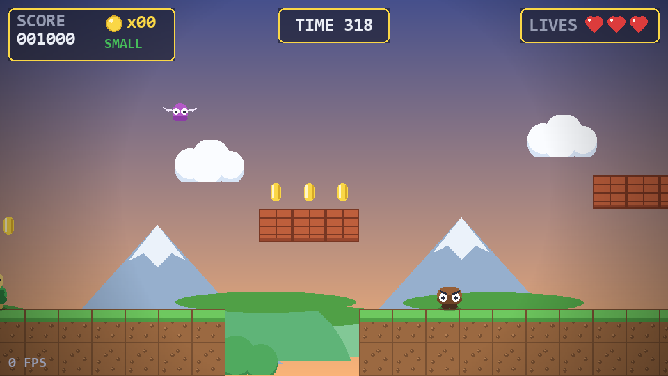
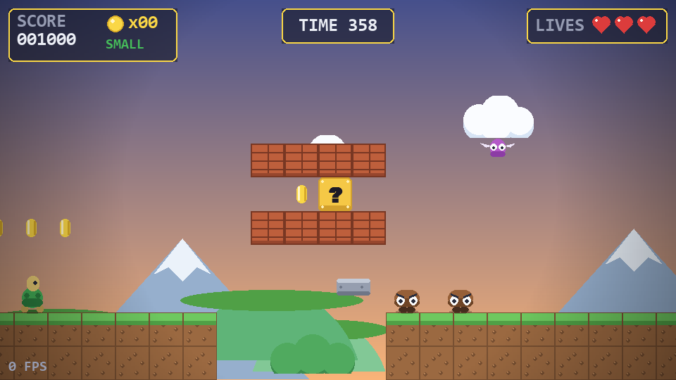

# 🍄 Super Pixel Quest

A complete, polished **Super Mario–style 2D platformer** built from scratch in
**Python 3 + PyGame**, structured as a professional, multi-module game project.

Everything — every sprite, every sound effect, every music track and every
level — is **generated procedurally in code**, so the whole game ships as
readable, reviewable text with *zero binary assets required to run*.

| Green Hills | Cliffside Caves | Sky Fortress |
|---|---|---|
|  |  |  |

